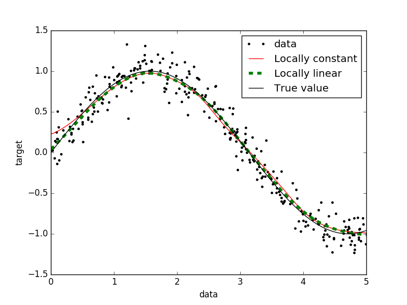
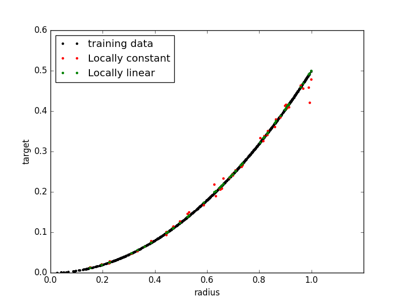

kernel_regression
=================

Implementation of locally constant (Nadaraya-Watson) and locally linear kernel regression with automatic bandwidth selection and adaptive kernel, compatible with sklearn.

Expanded from Jan Hendrik Metzen's kernel_regression package.  Major code redundancies between routines that I've yet to clean up.

- Improved numerical convergence of fit values far from training points
- Allows validation on "parallel sample" rather than cross-validation, which is
  useful when some points would be dominated by own kernel

Example of locally linear regression advantages in 1 and 2-d:

